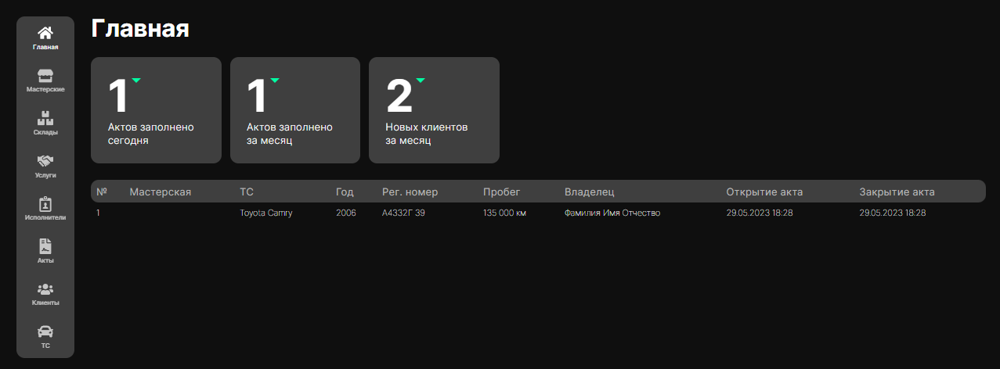
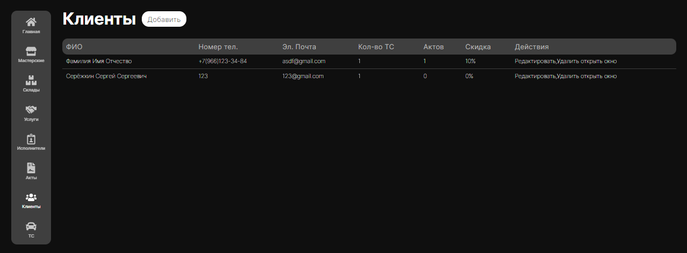
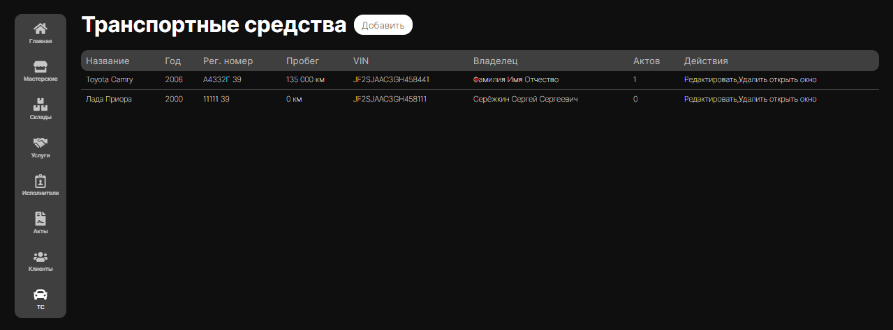

# Веб-приложение для авто-мастерских "Buhanka"

Добро пожаловать в веб-приложение для авто-мастерских "Buhanka"! Это приложение разработано для учета автомобилей, клиентов, услуг, запчастей и многое другое в авто-мастерских. С помощью этого приложения вы можете эффективно вести учет и управлять информацией о ремонте автомобилей и клиентах.

## Запуск приложения

Чтобы запустить приложение локально, выполните следующие инструкции:

1. Убедитесь, что у вас установлен Node.js на вашем компьютере.

2. Склонируйте этот репозиторий на свой локальный компьютер:
git clone https://github.com/Ggaabriel/Buhanka

3. Перейдите в папку проекта:

cd buhanka

4. Установите зависимости проекта, выполнив команду:

npm install

5. Запустите локальный сервер и приложение с помощью команды:

npm start

Это запустит сервер разработки, и вы сможете использовать приложение в браузере по адресу `http://localhost:3000`.

## Функциональность

- **Учет автомобилей**: Добавляйте и редактируйте информацию об автомобилях, включая марку, модель, год выпуска и другие данные.

- **Учет клиентов**: Ведите список клиентов и сохраняйте информацию о контактах, адресах и других данных клиентов.

- **Учет услуг**: Отслеживайте предоставляемые услуги, включая ремонтные работы, техническое обслуживание и другие типы услуг.

- **Учет запчастей**: Добавляйте информацию о запчастях, используемых в ремонте автомобилей, включая название, номера деталей и стоимость.

## Скриншоты

## Связь

Если у вас возникли вопросы или предложения, пожалуйста, свяжитесь со мной по электронной почте: sholakirill@icloud.com.

Спасибо, что использовали веб-приложение для авто-мастерских! Надеюсь, оно будет полезным в вашей работе!